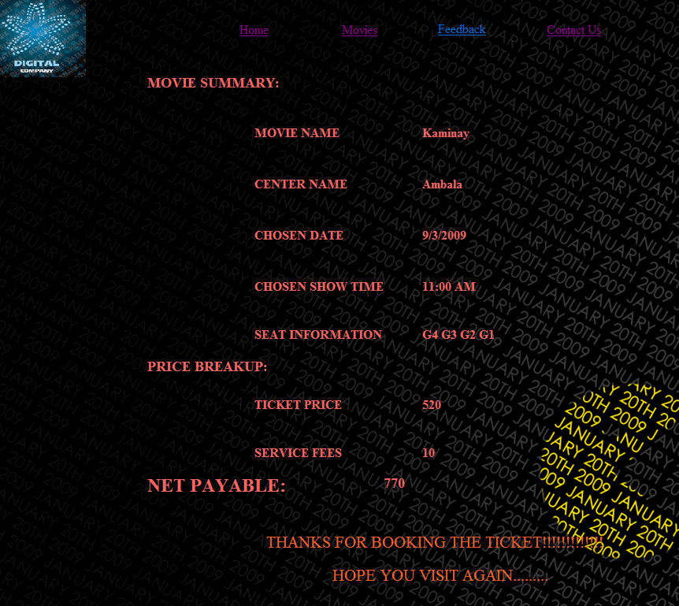

## **_Prepare operational documents_** {#prepare-operational-documents}

Objectives of testing.

First of all objectives should be clear.

*   Testing as a process of executing a program with the intent of finding errors.
*   To perform testing, test cases are designed. A test case is a particular made up of artificial situation upon which a program is exposed so as to find errors. So a good test case is one that finds undiscovered errors.
*   If testing is done properly, it uncovers errors and after fixing those errors we have software that is being developed according to specifications.

**Online Cinema Ticket Booking Description**

Welcome to newly designed website cinema ticket booking is a faster, cleaner and a tad more personal website, specially designed to make your booking experience better. Log on, navigate and find out for yourselves and if time permits leave your valuable feedback.

Customers may view the contents of any movie show at any time and may book any movie ticket as needed. The program automatically calculates the subtotal and grand total. When a visitor decides to finally book the ticket, the order information including the buyer&#039;s name, address and billing instruction is stored in the database securely and payment has been made.

The combo booking is also provided at the time of booking the ticket and there’s a wonderful facility of delivering the combos at your seat when you are watching the movie.

You need to register a new user whenever you have first visited or site then for future it will be stored in our database permanently and you can book you movie ticket at any time you want with this username and password.

**Online Cinema Ticket Booking Features**

*   Database Search Feature
*   Supports credit card transactions
*   Supports SQL database for movie database for speedy movie info lookups.
*   Can save customer contact information for their next visit, so they do not have to re-type it.
*   Using the SQL module the cart can handle very large product databases.
*   Ability to store order information in a secure file
*   Ability to order more than one ticket and combo at a time
*   Ability to assign the different seat numbers to different users.

**Online Cinema Ticket Booking Working**

The booking information is kept in a text database, which consists of: combo cost, username, seat type, no of seats booked, ticket cost and net payable amount to be paid by the customer. This database is modified when the user books the ticket. The customer can be presented with a booking page, which allows them to add more of the same items or remove items from the combo items. The booking page also shows the seat type to be booked, no of seats to be booked, service charges to be applied, ticketing cost and net payable amount to the customer.

When the customers have done their booking they will checkout using the payment information page. This page collects data about the customer, his bank name, his credit card number, credit card type, address, telephone number, mobile number, and CVV information.

DATA

FLOW

DIAGRAM

SNAPSHOTS

_Home Page_

_New User’s Registration Page_

This page will allow new users to register themselves with the website.

_User’s Login Page_

This webpage allow users to login in their account. The customer can also navigate back to home page.

_Ticket Booking Page_

_Payment Information Page_

_This page demands the user about what payment method he want to use._

_Page when Ticket is booked_

_This page displays the ticket information when the ticket is booked._

_Rules And Regulations Page_

_It displays the rules and regulations which the customer has to follow._

_Movies Page_

_Feedback Page_

_This page receives the valuable feedback of the customer._

_Tables Used in Database_

_Centers and movies names information_

__

_This page stores the movie information i.e. which movie is running at which center._

_Movie Information_

_This page stores the information about the movie schedule_

_Booking Page_

__

_This page keeps the information of combo cost, ticket cost, username, type of seat booked by the customer and so on…_

_Booking Data_

__

_This page stores the information about how many gold and silver tickets are currently booked._

SOURCE

CODE

**_Coding of home.aspx.cs_**

using System;

using System.Data;

using System.Configuration;

using System.Collections;

using System.Web;

using System.Web.Security;

using System.Web.UI;

using System.Web.UI.WebControls;

using System.Web.UI.WebControls.WebParts;

using System.Web.UI.HtmlControls;

using System.Data.SqlClient;

public partial class home : System.Web.UI.Page

{

public static DateTime tm;

protected void Page_Load(object sender, EventArgs e)

{

tm = DateTime.Today;

//drp_select_movie.Items.Add(&quot;Select Center&quot;);

}

protected void drp_select_movie_SelectedIndexChanged(object sender, EventArgs e)

{

drp_select_date.Items.Clear();

drp_select_date.Items.Add(&quot;Select Date&quot;);

drp_select_date.Items.Add(Convert.ToString(tm.ToShortDateString()));

tm = tm.AddDays(1);

drp_select_date.Items.Add(Convert.ToString(tm.ToShortDateString()));

tm = tm.AddDays(1);

drp_select_date.Items.Add(Convert.ToString(tm.ToShortDateString()));

drp_select_date.Enabled = true;

drp_select_date.Visible = true;

drp_select_movie.Enabled = false;

}

protected void drp_select_date_SelectedIndexChanged(object sender, EventArgs e)

{

drp_select_time.Enabled = true;

drp_select_time.Visible = true;

//drp_select_time.Items.Add(&quot;Select Time&quot;);

drp_select_date.Enabled = false;

}

protected void drp_select_center_SelectedIndexChanged(object sender, EventArgs e)

{

drp_select_movie.Enabled = true;

drp_select_movie.Visible = true;

//drp_select_movie.Items.Add(&quot;Select Movie&quot;);

drp_select_center.Enabled = false;

}

protected void drp_select_time_SelectedIndexChanged(object sender, EventArgs e)

{

}

protected void btn_reset_Click(object sender, EventArgs e)

{

Response.Redirect(&quot;home.aspx&quot;);

}

protected void btn_book_now_Click1(object sender, EventArgs e)

{

SqlConnection conn = new SqlConnection();

conn.ConnectionString = ConfigurationManager.ConnectionStrings[&quot;cinema_tckt_bookingConnectionString&quot;].ConnectionString;

conn.Open();

string center =Convert.ToString( drp_select_center.SelectedItem);

string movie = Convert.ToString( drp_select_movie.SelectedItem);

string date = drp_select_date.SelectedValue;

string time = Convert.ToString( drp_select_time.SelectedItem);

string sql = &quot;insert into movie_info (center_name,movie_name,date,time) values(&#039;&quot; + center + &quot;&#039;,&#039;&quot; + movie + &quot;&#039;,&#039;&quot; + date + &quot;&#039;,&#039;&quot; + time + &quot;&#039;)&quot;;

SqlCommand cmd = new SqlCommand(sql, conn);

cmd.ExecuteNonQuery();

string del=&quot;delete from booking_info&quot;;

string del1 = &quot;delete from booking&quot;;

string insert = &quot;insert into booking (no_of_seats,type) values(&#039;0&#039;,&#039;gold&#039;)&quot;;

string insert1 = &quot;insert into booking (no_of_seats,type) values(&#039;0&#039;,&#039;silver&#039;)&quot;;

SqlCommand delete = new SqlCommand(del, conn);

SqlCommand delete1 = new SqlCommand(del1, conn);

SqlCommand inser = new SqlCommand(insert, conn);

SqlCommand inser1 = new SqlCommand(insert1, conn);

delete.ExecuteNonQuery();

delete1.ExecuteNonQuery();

inser.ExecuteNonQuery();

inser1.ExecuteNonQuery();

Response.Redirect(&quot;login.aspx?m=&quot;+movie);

}

}

**_Coding of login.aspx.cs_**

using System.Configuration;

using System.Data;

//using System.Linq;

using System.Web;

using System.Web.Security;

using System.Web.UI;

using System.Web.UI.HtmlControls;

using System.Web.UI.WebControls;

using System.Web.UI.WebControls.WebParts;

//using System.Xml.Linq;

using System.Data.SqlClient;

public partial class login : System.Web.UI.Page

{

protected void Page_Load(object sender, EventArgs e)

{

}

protected void btn_login_Click(object sender, EventArgs e)

{

string u = Request.QueryString[&quot;m&quot;];

SqlConnection conn = new SqlConnection();

conn.ConnectionString = ConfigurationManager.ConnectionStrings[&quot;cinema_tckt_bookingConnectionString&quot;].ConnectionString;

conn.Open();

string sql = &quot;select * from login where username=&#039;&quot; + txt_uname.Text + &quot;&#039; and password=&#039;&quot; + txt_password.Text + &quot;&#039;&quot;;

SqlCommand cmd = new SqlCommand(sql, conn);

SqlDataReader dr;

dr = cmd.ExecuteReader();

if (dr.Read())

{

conn.Close();

conn.Open();

string sql1 = &quot;update movie_info set username=&#039;&quot;+txt_uname.Text+&quot;&#039; where movie_name=(&#039;&quot;+ u +&quot;&#039;)&quot;;

SqlCommand cmd1 = new SqlCommand(sql1, conn);

cmd1.ExecuteNonQuery( );

lbl_message.Text = &quot;login sucessfull&quot;;

Response.Redirect(&quot;booking.aspx?q=&quot;+txt_uname.Text);

}

else

lbl_message.Text = &quot;login failed&quot;;

}

protected void btn_register_Click(object sender, EventArgs e)

{

Response.Redirect(&quot;register.aspx&quot;);

}

}

**_Coding of booking.aspx.cs_**

using System;

using System.Collections;

using System.Configuration;

using System.Data;

//using System.Linq;

using System.Web;

using System.Web.Security;

using System.Web.UI;

using System.Web.UI.HtmlControls;

using System.Web.UI.WebControls;

using System.Web.UI.WebControls.WebParts;

using System.Data.SqlClient;

public partial class Booking : System.Web.UI.Page

{

int ticket_price=0;

int total_cost;

protected void Page_Load(object sender, EventArgs e)

{

GridView1.SelectedIndex = -1;

}

protected void GridView1_SelectedIndexChanged(object sender, EventArgs e)

{

string display=&quot;Combos=&quot;;

int s;

total_cost = 0;

s = GridView1.SelectedIndex;

switch (s)

{

case 0:

total_cost +=Convert.ToInt16(lbl_total_price.Text);

display += Convert.ToString(GridView1.SelectedValue);

lbl_combo_cost.Text = &quot;100&quot;;

total_cost += 100;

break;

case 1:

total_cost += Convert.ToInt16(lbl_total_price.Text);

display += Convert.ToString(GridView1.SelectedValue);

lbl_combo_cost.Text=&quot;150&quot;;

total_cost += 150;

break;

case 2:

total_cost +=Convert.ToInt16( lbl_total_price.Text);

display += Convert.ToString(GridView1.SelectedValue);

lbl_combo_cost.Text = &quot;170&quot;;

total_cost += 170;

break;

case 3:

total_cost +=Convert.ToInt16( lbl_total_price.Text);

total_cost += 200;

lbl_combo_cost.Text = &quot;200&quot;;

display += Convert.ToString(GridView1.SelectedValue);

break;

}

lbl_combo_display.Text = display.ToString();

lbl_total_price.Text=total_cost.ToString();

}

protected void btn_reset_Click(object sender, EventArgs e)

{

total_cost = 0;

lbl_total_price.Text = &quot;0&quot;;

}

protected void btn_seat_select_Click(object sender, EventArgs e)

{

if (DropDownList2.SelectedIndex == 0)

lbl_error1.Text = &quot;please select the ticket type and quantity&quot;;

else

{

string w = Request.QueryString[&quot;q&quot;];

Response.Redirect(&quot;Payment.aspx?e=&quot; + w);

}

}

protected void btn_how_to_collect_tckt_Click(object sender, EventArgs e)

{

Response.Redirect(&quot;how to collect your ticket.aspx&quot;);

}

protected void btn_rules_regulations_Click(object sender, EventArgs e)

{

Response.Redirect(&quot;rule and regulations.aspx&quot;);

}

protected void DropDownList2_SelectedIndexChanged(object sender, EventArgs e)

{

string w = Request.QueryString[&quot;q&quot;];

total_cost =Convert.ToInt16(lbl_total_price.Text);

if (DropDownList1.SelectedValue == &quot;1&quot;)

ticket_price = 130;

if (DropDownList1.SelectedValue == &quot;2&quot;)

ticket_price = 110;

int s =Convert.ToInt16(DropDownList2.SelectedValue);

ticket_price = ticket_price * s;

txt_ticket_price.Text = ticket_price.ToString(); ;

txt_ticket_price.Enabled = false;

txt_combo_price.Text = total_cost.ToString();

txt_combo_price.Enabled = false;

txt_service_fees.Text = &quot;10&quot;;

txt_service_fees.Enabled = false;

int net_payable;

net_payable = total_cost + ticket_price;

txt_net_payable.Text = net_payable.ToString();

txt_net_payable.Enabled = false;

SqlConnection conn = new SqlConnection();

conn.ConnectionString = ConfigurationManager.ConnectionStrings[&quot;cinema_tckt_bookingConnectionString&quot;].ConnectionString;

conn.Open();

int a = Convert.ToInt16(txt_combo_price.Text);

int b = Convert.ToInt16(txt_ticket_price.Text);

string c = Convert.ToString(DropDownList1.SelectedItem);

int d = Convert.ToInt16(DropDownList2.SelectedValue);

int f = Convert.ToInt16(txt_net_payable.Text);

string seat_typ=&quot;1&quot;,total_seat=&quot;1&quot;;

if (DropDownList1.SelectedValue == &quot;1&quot;)

{

seat_typ = &quot;select no_of_seats from booking where type=&#039;gold&#039;&quot;;

total_seat = &quot;select gold from seats&quot;;

}

if (DropDownList1.SelectedValue == &quot;2&quot;)

{

seat_typ = &quot;select no_of_seats from booking where type=&#039;silver&#039;&quot;;

total_seat = &quot;select silver from seats&quot;;

}

SqlCommand seat = new SqlCommand(seat_typ, conn);

SqlCommand tot_seat = new SqlCommand(total_seat, conn);

total_seat = tot_seat.ExecuteScalar().ToString();

int t_seat= Convert.ToInt16(total_seat);

string seat_info = seat.ExecuteScalar().ToString() ;

int drp=DropDownList2.SelectedIndex;

int s_info= Convert.ToInt16(seat_info);

s_info = s_info + drp;

string sql,no_of_seats,type;

if(s_info&lt;t_seat)

{

if (DropDownList1.SelectedValue == &quot;1&quot;)

{

type = &quot;update booking set no_of_seats=&#039;&quot; + s_info + &quot;&#039;,seat_booked_now=&#039;gold&#039; where type=&#039;gold&#039;&quot;;

sql = &quot;insert into booking_info (username,gold_booked,combo_cost,ticket_cost,seat_type,no_of_seats,net_payable) values(&#039;&quot; + w + &quot;&#039;,&#039;&quot; + s_info + &quot;&#039;,&#039;&quot; + a + &quot;&#039;,&#039;&quot; + b + &quot;&#039;,&#039;&quot; + c + &quot;&#039;,&#039;&quot; + d + &quot;&#039;,&#039;&quot; + f + &quot;&#039;)&quot;;

}

else

{

type = &quot;update booking set no_of_seats=&#039;&quot; + s_info + &quot;&#039;,seat_booked_now=&#039;silver&#039; where type=&#039;silver&#039;&quot;;

sql = &quot;insert into booking_info (username,silver_booked,combo_cost,ticket_cost,seat_type,no_of_seats,net_payable) values(&#039;&quot; + w + &quot;&#039;,&#039;&quot; + s_info + &quot;&#039;,&#039;&quot; + a + &quot;&#039;,&#039;&quot; + b + &quot;&#039;,&#039;&quot; + c + &quot;&#039;,&#039;&quot; + d + &quot;&#039;,&#039;&quot; + f + &quot;&#039;)&quot;;

}

SqlCommand typ = new SqlCommand(type, conn);

SqlCommand cmd = new SqlCommand(sql, conn);

typ.ExecuteNonQuery();

cmd.ExecuteNonQuery();

}

else

Response.Write(&quot;not enough seats available&quot;);

}

}

_CONCLUSION OF THE PROJECT_

The project has been developed successfully and the performance of the system has been found satisfactory. The security has been incorporated as required by any placement firm. Use of computer helps the user in reducing the time wasted in non-productive work. It further helps the user in having immediate access to the information as well as to share the limited resources effectively.

User friendly menu driven interface has been provided to the user to interact with the system. Users can traverse through the website provided the users have the access right set. The users can register themselves through a registration form and then can use the services of the website.

The system provides an integrated environment for the customers who are willing to watch movies currently running in the audi and can also enjoy combo packs while watching movie.

_LIMITATIONS OF THE PROJECT_

The following are the limitations of the project:

*   _No Multi-User Support Is Provided_

At a time only one user can use the software. In same companies, the computers are interconnected to form a network. But this software will work on only one computer at a time.

*   _Login Password Is_ _Not Encrypted_

The username and password provided to us is not encrypted properly. Any person that gets to know the username and password of a user can access his account. So keep your password safe.

*   _No Backup And Restore Utilities Are Incorporated_

In these times of uncertainties, incorporation of the facilities of backup and restoration of last details is necessary. Any computer can crash or become affected by a virus at any time. So it is imperative to take the backup of the data, but this software does not provide this utility.

REFERENCES

1.  [www.google.com](http://www.google.com)
2.  [www.howstuffworks.com](http://www.howstuffworks.com)
3.  [www.bing.com](http://www.bing.com)
4.  [www.wikiepedia.org](http://www.wikiepedia.org)
5.  [www.microsoft.com](http://www.microsoft.com)
6.  ASP.NET by Wrox Publications
7.  ASP.NET 2.0 Unleashed
8.  Comdex ASP.NET